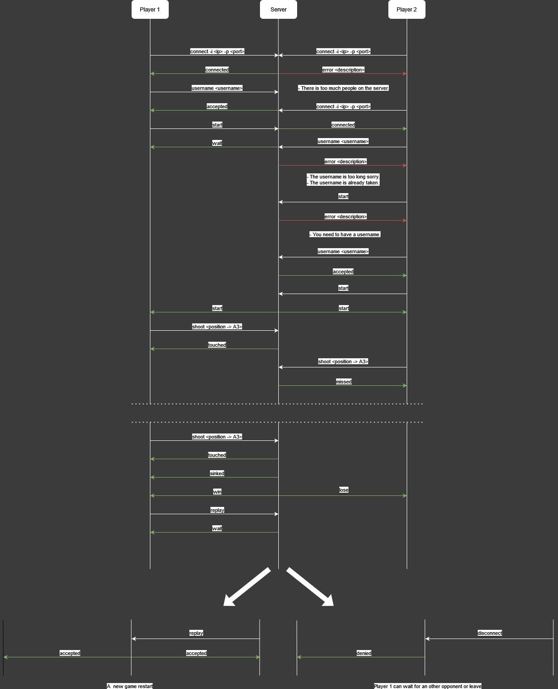

# SheepMyBoat

```
                             v  ~.      v
                    v           /|
                               / |          v
                        v     /__|__
                            \--------/
~~~~~~~~~~~~~~~~~~~~~~~~~~~~~`~~~~~~'~~~~~~~~~~~~~~~~~~~~~~~~~~~~~~~~~~~~
```
## Description
SheepMyBoat is a TCP two players game application.    
It's a twin of the Battleship game.


## Installation
Download the .jar file into the lastest [release]() and run the command explained into the Commands chapter. You can also download the source code and build the code with Maven but make sure to have included all dependencies.


## Usage
SheepMyBoat offers two main commands.   
One to launch the game serveur and another one to launch the players.


## Commands

### Launch the game server

```sh
java -jar <path-to-jar> server -a <address> -p <port>
```

### Launch a player(client)

```sh
java -jar <path-to-jar> client -a <address> -p <port>
```

### Description

- `-a, --address <outputFile>`: IP address to connect.
- `-p, --port <outputFile>`: Port to connect.


## Application's protocol

### 1 - Overview
The SheepMyBoat protocol is meant to play a battleship game over the network. It's a client-server protocol.   
The client connects to a server and request to play a new game if another player is also ready to play.    
The server manage the game's logic between the two players.   

### 2 - Transport protocol
The SheepMyBoat protocol uses the **TCP protocol**. The server runs on port **3333**.  
The client has to know the IP address of the server to connect to. It establishes the connection with the server.   
The client closes the connection when he dosen't want to play more games.   
 
### 3 - Messages
#### Connect to the server
Command: `connect -i <ip> -p <port>`
|Response|Detail| 
| ---- | ---- |
|`connected`|The client is connected!|
|`error <description>`|There is too much people on the server.|

#### Register username
Command: `username <username>`
|Response|Detail|
| ---- | ---- |
|`accepted`|The username as been added.|
|`error <description>`|The username is too long sorry.|
|`error <description>`|The username is already taken (by the oppenent).|

#### Start game
Command: `start`
|Response|Detail|
| ---- | ---- |
|`start`|The game start!|
|`wait`|The other player is not ready yet.|
|`error <description>`|You need to have a username.|

#### Attack a sheep
Command: `Shoot <position -> B1>`
|Response|Detail|
| ---- | ---- |
|`touched`|You touched a sheep.|
|`missed`|You missed the shot.|
|`sinked`|You sink a boat.|

#### Finish game
|Response|Detail|
| ---- | ---- |
|`end <winner>`|The game is finished|

Command : `Replay`
|Response|Detail|
| ---- | ---- |
|`accepeted`|Your oppenent accepted the challenge.|
|`wait`|Your oppenent is choosing.|
|`denied`|Your oppenent deserted.|

### 4 - Examples


